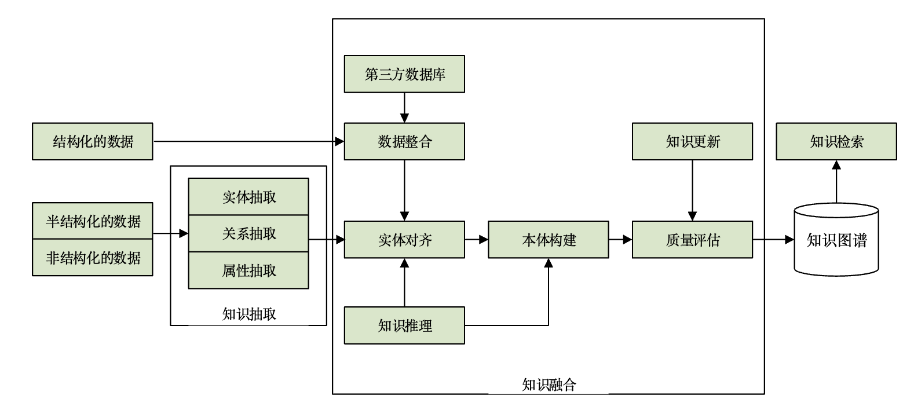

# 知识图谱技术综述

主要核心技术：

1. 知识抽取
2. 知识表示
3. 知识融合
4. 知识推理

语义网：推广、完善使用本体模型来形式化表达数据中的隐含语义。

- RDF (resource  description  framework)模式(RDF  schema)
- 万维网本体语言(Web  ontology  language，OWL)的形式化模型

## 知识图谱的定义

本质上，知识图谱是一种 **揭示实体之间关系的语义网络**，可以对现实世界的事物及其相互关系进行形式化地描述。现在的知识图谱已被用来泛指各种大规模的**知识库**。

知识图谱的通用表示方式是三元组 $G=(E,R,S)$ 其中 $E$ 是知识库中的实体集合，共包含 $|E|$ 种不同实体；$R$ 是知识库中的关系集合，共包含 $|R|$ 种不同关系； $S\subseteq E \times R \times E$ 代表知识库中的三元组集合。

> 三元组的基本形式主要包括实体1、关系、实体2和概念、属性、属性值等，实体是知识图谱中的最基本元素，不同的实体间存在不同的关系。
>
> - 概念主要指集合、类别、对象类型、事物的种类，例如人物、地理等；
> - 属性主要指对象可能具有的属性、特征、特性、特点以及参数，例如国籍、生日等；
> - 属性值主要指对象指定属性的值，例如中国、1988-09-08等。
>
> 每个实体(概念的外延)可用一个全局唯一确定的ID来标识，每个属性-属性值对(attribute-value  pair，AVP )可用来刻画实体的内在特性，而关系可用来连接两个实体，刻画它们之间的关联。

## 知识图谱的架构

### 逻辑结构

知识图谱在逻辑上可分为 **模式层** 与 **数据层** 两个层次:

- 数据层主要是由一系列的事实组成，而知识将以事实为单位进行存储。如果用(实体1，关系，实体2)、(实体、属性，属性值)这样的三元组来表达事实，可选择图数据库作为存储介质，例如开源的 `Neo4j`、Twitter的  `FlockDB`、sones 的 `GraphDB`等。
- 模式层构建在数据层之上，主要是通过本体库来 **规范数据层** 的一系列事实表达。本体是结构化知识库的概念模板，通过本体库而形成的知识库不仅层次结构较强，并且冗余程度较小。

### 体系架构

知识图谱的体系架构是其指构建模式结构，如图所示。其中框内的部分为 **知识图谱的构建过程**，该过程需要随人的认知能力不断更新迭代。知识图谱主要有自顶向下(top-down)与自底向上(bottom-up)两种构建方式。

* 自顶向下指的是 **先为知识图谱定义好本体与数据模式，再将实体加入到知识库**。该构建方式需要利用一些现有的结构化知识库作为其基础知识库，例如 Freebase 项目就是采用这种方式，它的绝大部分数据是从维基百科中得到的。

- 自底向上指的是从一些开放链接数据中提取出实体，选择其中置信度较高的加入到知识库，再构建顶层的本体模式。

目前，大多数知识图谱都采用自底向上的方式进行构建，其中最典型就是 Google 的 Knowledge Vault。

## 大规模知识库

### 开放链接知识 

在 LOD 项目的云图中，Freebase、Wikidata、DBpedia、YAGO 这 4 个大规模知识库处于绝对核心的地位，它们中不仅包含大量的半结构化、非结构化数据，是知识图谱数据的重要来源。而且具有**较高的领域覆盖面**，与领域知识库存在大量的链接关系。

1. Freebase：Freebase中的数据主要是由人工构建，另外一部分数据则主要来源于维基百科、IMDB、Flickr等网站或语料库。在 2015年6月，Freebase 整体移入 Wikidata。
2. Wikidata：**协作式多语言辅助知识库**；它是Wikipedia、Wikivoyage、Wikisource中结构化数据的中央存储器，并支持免费使用。Wikidata中的数据主要以文档的形式进行存储，目前已包含了超过1 700万个文档。其中的每个文档都有一个主题或一个管理页面，且被唯一的数字标识。
3. DBpedia：**多语言综合型知识库**；DBpedia是从多种语言的维基百科中抽取结构化信息，并且将其以关联数据的形式发布到互联网上，提供给在线网络应用、社交网站以及其他在线知识库。DBpedia还能够自动与维基百科保持同步，覆盖多种语言。
4. YAGO：YAGO整合了维基百科、WordNet以及GeoNames等数据源，特别是将维基百科中的分类体系与WordNet的分类体系进行了融合，构建了一个复杂的类别层次结构体系。

### 垂直行业知识

行业知识库也可称为垂直型知识库，这类知识库的描述目标是特定的行业领域，通常需要依靠特定行业的数据才能构建，因此其描述范围极为有限。

1. IMDB（internet movie database）：是一个关于电影演员、电影、电视节目、电视明星以及电影制作的资料库。
2. MusicBrainz：是一个结构化的音乐维基百科，致力于收藏所有的音乐元数据，并向大众用户开放。任何注册用户都可以向网站中添加信息或投稿。
3. ConceptNet：是一个语义知识网络，主要由一系列的代表概念的结点构成，这些概念将主要采用自然语言单词或短语的表达形式，通过相互连接建立语义联系。

## 重点关键技术

### 知识抽取

通过知识抽取技术，可以从一些公开的半结构化、非结构化的数据中提取出实体、关系、属性等知识要素。

知识抽取主要是面向开放的链接数据，通过自动化的技术抽取出可用的知识单元，知识单元主要包括 **实体(概念的外延)、关系以及属性** 3个知识要素，并以此为基础，形成一系列高质量的事实表达，为上层模式层的构建奠定基础。

#### 实体抽取

早期的实体抽取也称为命名实体学习(named entity   learning)或命名实体识别(named   entity   recognition)，指的是从原始语料中自动识别出命名实体。由于实体是知识图谱中的最基本元素，其抽取的完整性、准确率、召回率等将直接影响到知识库的质量。因此，实体抽取是知识抽取中最为基础与关键的一步。

##### 基于规则与词典的方法

> 基于规则的方法通常需要为目标实体编写模板，然后在原始语料中进行匹配；

早期的实体抽取是在限定文本领域、限定语义单元类型的条件下进行的，主要采用的是基于规则与词典的方法，例如使用已定义的规则，抽取出文本中的人名、地名、组织机构名、特定时间等实体。

基于规则模板的方法不仅需要依靠大量的专家来编写规则或模板，覆盖的领域范围有限，而且很难适应数据变化的新需求。

##### 基于统计机器学习的方法

> 基于统计机器学习的方法主要是通过机器学习的方法对原始语料进行训练，然后再利用训练好的模型去识别实体；

将机器学习中的监督学习算法用于命名实体的抽取问题上。但单纯的监督学习算法在性能上不仅受到训练集合的限制，并且算法的准确率与召回率都不够理想。监督学习算法与规则也可以相互结合。

##### 面向开放域的抽取方法

> 面向开放域的抽取将是面向海量的Web语料

针对如何从少量实体实例中自动发现具有区分力的模式，进而扩展到海量文本去给实体做分类与聚类的问题：

1. 通过迭代方式扩展实体语料库的解决方案，其基本思想是通过少量的实体实例建立特征模型，再通过该模型应用于新的数据集得到新的命名实体。
2. 基于无监督学习的开放域聚类算法，其基本思想是基于已知实体的语义特征去搜索日志中识别出命名的实体，然后进行聚类。

#### 关系抽取

关系抽取的目标是 **解决实体间语义链接** 的问题：

1. 早期的关系抽取主要是通过人工构造语义规则以及模板的方法识别实体关系。
2. 随后，实体间的关系模型逐渐替代了人工预定义的语法与规则。但是仍需要提前定义实体间的关系类型。
3. 面向开放域的信息抽取框架(open   information   extraction,OIE)，这是抽取模式上的一个巨大进步。但OIE方法在对实体的隐含关系抽取方面性能低下，因此部分研究者提出了 **基于马尔可夫逻辑网、基于本体推理的深层隐含关系抽取**方法。

> [马尔科夫链](./马尔科夫链.md)

##### 开放式实体关系抽取

开放式实体关系抽取可分为二元开放式关系抽取和n元开放式关系抽取。

- 在二元开放式关系抽取中，早期的研究有 KnowItAll 与 TextRunner 系统，在准确率与召回率上表现一般。
- 基于Wikipedia的OIE方法WOE，经自监督学习得到抽取器，准确率较TextRunner有明显的提高。
- 针对WOE的缺点提出了第二代OIE  ReVerb系统，以动词关系抽取为主。
- 第三代OIE系统OLLIE(open language learning for information extraction)，尝试弥补并扩展OIE的模型及相应的系统，抽取结果的准确度得到了增强。

然而，基于语义角色标注的OIE分析显示：英文语句中40%的实体关系是n元的，如处理不当，可能会影响整体抽取的完整性。提出了一种可抽取任意英文语句中n元实体关系的方法 `KPAKEN`，弥补了ReVerb的不足。但是由于算法对语句深层语法特征的提取导致 **其效率显著下降**，并不适用于大规模开放域语料的情况。

##### 基于联合推理的实体关系抽取

联合推理的关系抽取中的典型方法是马尔可夫逻辑网 `MLN`(Markov  logic  network)，它是一种将马尔可夫网络与一阶逻辑相结合的统计关系学习框架，同时也是在OIE中融入推理的一种重要实体关系抽取模型。

- 基于该模型提出了一种无监督学习模型 `StatSnowball`，不同于传统的OIE，该方法可自动产生或选择模板生成抽取器。
- 在StatSnowball的基础上提出了一种实体识别与关系抽取相结合的模型EntSum，主要由扩展的CRF（条件随机场，Conditional Random Field）命名实体识别模块与基于StatSnowball的关系抽取模块组成，在保证准确率的同时也提高了召回率。
- 一种简易的Markov逻辑TML(tractable Markov  logic)，TML将领域知识分解为若干部分，各部分主要来源于事物类的层次化结构，并依据此结构，将各大部分进一步分解为若干个子部分，以此类推。TML具有较强的表示能力，能够较为简洁地表示概念以及关系的本体结构。

#### 属性抽取

属性抽取主要是针对实体而言的，通过属性可形成对实体的完整勾画。由于实体的属性可以看成是实体与属性值之间的一种 **名称性关系**，因此可以将实体属性的抽取问题转换为关系抽取问题。

基于规则与启发式算法的属性抽取方法能够从Wikipedia及WordNet的半结构化网页中自动抽取相应的属性名称与属性值，还可扩展为一套本体知识库。实验表明：该算法的抽取准确率可达到95%。

大量的属性数据主要存在于半结构化、非结构化的大规模开放域数据集中。抽取这些属性的方法：

- 一种是将上述从百科网站上抽取的结构化数据作为可用于属性抽取的训练集，然后再将该模型应用于开放域中的实体属性抽取；
- 另一种是根据实体属性与属性值之间的关系模式，直接从开放域数据集上抽取属性。但是由于属性值附近普遍存在一些限定属性值含义的属性名等，所以该抽取方法的准确率并不高。

### 知识表示

基于三元组的知识表示形式受到了人们广泛的认可，但是其在计算效率、数据稀疏性等方面却面临着诸多问题。

可以将实体的语义信息表示为稠密低维实值向量，进而在低维空间中高效计算实体、关系及其之间的复杂语义关联，对知识库的构建、推理、融合以及应用均具有重要的意义。

#### 应用场景

分布式表示旨在用一个综合的向量来表示实体对象的语义信息，是一种模仿人脑工作的表示机制，通过知识表示而得到的分布式表示形式在知识图谱的计算、补全、推理等方面将起到重要的作用：

* 语义相似度计算。由于实体通过分布式表示而形成的是一个个低维的实值向量，所以，可使用 **熵权系数法**、**余弦相似性** 等方法计算它们间的相似性。这种相似性刻画了实体之间的语义关联程度，为自然语言处理等提供了极大的便利。
* 链接预测。通过分布式表示模型，可以预测图谱中任意两个实体之间的关系，以及实体间已存在的关系的正确性。尤其是在大规模知识图谱的上下文中，需要不断补充其中的实体关系，所以链接预测又被称为知识图谱的补全。

#### 代表模型

知识表示学习的代表模型主要包括距离模型、双线性模型、神经张量模型、矩阵分解模型、翻译模型等。

##### 距离模型

知识库中实体以及关系的结构化表示方法(structured embedding，SE)，其基本思想是：首先将实体用向量进行表示，然后 **通过关系矩阵将实体投影到与实体向量同一维度的向量空间中**，最后通过计算投影向量之间的距离来判断实体间已存在的关系的置信度。由于距离模型中的关系矩阵是两个不同的矩阵（每个关系类型 $r_k$ 对应唯一的一对矩阵 $(R_k^{\text{lhs}}, R_k^{\text{rhs}})$，用于转换实体向量），故**实体间的协同性较差**，这也是该模型本身的主要缺陷。

> 对于三元组 $(e^l, r, e^r)$，关系矩阵对实体向量进行方向特异性的变换：
>
> $R_r^{\text{lhs}} \cdot E_{e^l} \quad \text{和} \quad R_r^{\text{rhs}} \cdot E_{e^r}$

##### 单层神经网络模型

针对上述提到的距离模型中的缺陷，提出了采用单层神经网络的非线性模型(single  layer  model，SLM)，模型为知识库中每个三元组$(h,r,t)$定义了以下形式的评价函数：

$f_r(h,t)=\mu_t^Tg(M_{r,1}l_h+M_{r,2}l_t)$

式中，$\mu_r^T\in R^k$ 为关系 $r$ 的向量化表示；$g()$ 为 tanh 函数；$M_{r,1}$、$M_{r,2}\in R^{d\times k}$ 是通过关系 $r$ 定义的两个矩阵。单层神经网络模型的非线性操作虽然能够进一步刻画实体在关系下的语义相关性，但在计算开销上却大大增加。

##### 双线性模型

双线性模型又叫隐变量模型(latent   factor   model，LFM)，模型为知识库中每个三元组 $(h,r,t)$定义的评价函数具有如下形式：

$$
f_r(h,t)=l_h^TM_rl_t
$$

式中 $M_r\in R^{d\times d}$ 是通过关系 $r$ 定义的双线性变换矩阵，$l_h、l_t \in R^d$ 是三元组中头实体与尾实体的向量化表示。

双线性模型主要是通过基于实体间关系的双线性变换来刻画实体在关系下的语义相关性。模型不仅形式简单、易于计算，而且还能够有效刻画实体间的协同性。

基于上述工作，尝试将双线性变换矩阵$M_r$变换为对角矩阵，提出了 DISTMULT 模型，不仅简化了计算的复杂度，并且实验效果得到了显著提升。

> - 解耦变量关系：双线性模型通常涉及两个变量的相互作用，如$y=x_1^TWx_2$，其中$W$是变换矩阵。若$W$为对角矩阵$D$，模型变为$y=x_1^TDx=\sum_id_{ii}x_{1i}x_{2i}$，这使得每个维度上的变量相互独立地对结果产生影响，更易于理解和分析模型的行为，在一些变量间本就存在较弱耦合或应独立作用的场景下，符合实际情况，可能提升实验效果。
> - 简化计算与降低复杂度：矩阵乘法中，对角矩阵与向量相乘只需对向量的每个元素进行简单的标量乘法，计算量大幅减少。在处理大规模数据或复杂模型结构时，能显著降低计算成本，提高训练和推理速度，这对于实时性要求高或资源有限的实验环境非常重要，也有助于减少数值误差的积累，提高计算稳定性。

##### 神经张量模型

神经张量模型，其基本思想是：在不同的维度下，将实体联系起来，表示实体间复杂的语义联系。模型为知识库中的每个三元组$(h,r,t)$定义了以下形式的评价函数:

$$
f_r(h,t)=\mu_r^Tg(l_hM_rl_t+M_{r,1}l_h+M_{r,2}l_t+b_r)
$$

式中，$\mu_r^T\in R^k$ 为关系 $r$ 的向量化表示；$g()$ 为 tanh 函数；$M_{r,1}$、$M_{r,2}\in R^{d\times k}$ 是通过关系 $r$ 定义的两个投影矩阵。

神经张量模型在构建实体的向量表示时，是将**该实体中的所有单词的向量取平均值**，这样一方面可以重复使用单词向量构建实体，另一方面将有利于增强低维向量的稠密程度以及实体与关系的语义计算。

##### 矩阵分解模型

通过矩阵分解的方式可得到低维的向量表示，故不少研究者提出可采用该方式进行知识表示学习，其中的典型代表是 RESACL 模型。

> 主要思想是以数据结构中邻接矩阵这个概念，获得与该实体节点相连接的其他实体节点和关系边之间潜在的拓扑关系。

在 RESCAL 模型中，知识库中的三元组 $(h,r,t)$ 集合被表示为一个 **三阶张量**

- 如果该三元组存在，张量中对应位置的元素被置1，否则置为0 ==> 其二维切平面为 **串联的实体向量各自表示**，而第三维则为 **实体之间的关系谓词**，如果两个实体之间存在着关系，则三维张量对应的点为1，否则为0
- 通过张量分解算法，可将张量中每个三元组 $(h,r,t)$ 对应的张量值 $X_{hrt} $ 分解为双线性模型中的知识表示形式 $l_h^TM_rl_t$, 并使 $|X_{hrt}-l_h^TM_rl_t|_{L_2}$ 尽量小。

> 张量分解算法不一定会导致张量降维，从常见张量分解算法进行分析：
>
> - **可能导致降维的张量分解算法**
>   - **主成分分析（PCA）**：从某种角度看可视为一种针对矩阵（二阶张量）的分解算法。它通过对数据协方差矩阵的特征分解，将原始数据投影到由主成分张成的低维空间中，通常会实现数据的降维。例如在图像数据处理中，若将图像看作矩阵形式的二阶张量，使用PCA可以提取主要特征，去除一些冗余信息，实现将图像数据从高维空间投影到低维空间，达到降维目的。
>   - **典型相关分析（CCA）**：常被用于处理两个随机向量之间的相关性，也可看作一种张量分解的思想。在多模态数据融合等场景中，它试图找到两个数据集合的线性组合，使得它们之间的相关性最大，在这个过程中往往会对数据进行降维处理，以便更好地分析和理解不同模态数据之间的关系。
> - **通常不会导致降维的张量分解算法**
>   - **张量奇异值分解（T-SVD）**：是奇异值分解（SVD）在张量上的推广。它将一个张量分解为多个成分，但分解后的各个成分仍然保持着张量的结构，并没有直接对张量进行维度上的降低。例如在视频处理中，将视频看作一个三阶张量，T-SVD可以对视频的时空信息进行分解，但不会改变视频本身的维度结构，即不会减少视频的帧数、分辨率等维度信息。
>   - **CANDECOMP/PARAFAC分解（CP分解）**：把一个张量分解为一系列秩一张量的和，其目的不是为了降维，而是为了揭示张量数据中的潜在结构和关系。例如在化学计量学中，对三维的光谱数据进行CP分解，可以将其分解为纯物质的光谱、浓度分布等成分，这些成分共同构成了原始的三维张量，并没有降低张量的维度。

RESCAL模型的核心思想是**将整个知识图谱编码为一个三维张量（集体学习 collective learning）**，由这个张量分解出一个核心张量和一个因子矩阵，核心张量中每个二维矩阵切片代表一种关系，因子矩阵中每一行代表一个实体。由核心张量和因子矩阵还原的结果被看作对应三元组成立的概率，如果概率大于某个值，则对应三元组正确；否则不正确。

##### 翻译模型

受到 **平移不变现象** 的启发，提出了TransE模型，即将知识库中实体之间的关系看成是从实体间的某种平移，并用向量表示。

- 关系 $l_r$ 可以看作是从头实体向量 $l_h$ 到尾实体向量 $l_t$ 的翻译。
- 对于知识库中的每个三元组 $(h,r,t)$, TransE 都希望满足以下关系 $l_h+l_r\approx l_t$ , 其损失函数为 $f_r(h,t)=|l_h+l_r-l_t|_{L_1/L_2}$, 即向量 $l_h+l_r$ 和 $l_t$ 的 $L_1$ 或 $L_2$ 距离。

该模型的参数较少，计算的复杂度显著降低。与此同时，TransE模型在大规模稀疏知识库上也同样具有较好的性能与可扩展性。

#### 复杂关系模型

知识库中的实体关系类型也可分为

- `1-to-1`
- `1-to-N`
- `N-to-1`
- `N-to-N`

4种类型，而复杂关系主要指的是1-to-N、N-to-1、N-to-N的3种关系类型。由于TransE模型不能用在处理复杂关系上，一系列**基于它的扩展模型**纷纷被提出，下面将着重介绍其中的几项代表性工作。

##### TransH 模型

TransH 模型尝试 **通过不同的形式表示不同关系中的实体结构**，对于同一个实体而言，它在不同的关系下也扮演着不同的角色。

模型首先通过关系向量 $l_r$ 与其正交的法向量 $w_r$ 选取某一个超平面 $F$，然后将头实体向量 $l_h$ 和尾实体向量 $l_t$ 沿法向量 $w_r$ 的方向投影到 $F$，最后计算损失函数。TransH使不同的实体在不同的关系下拥有了不同的表示形式，但由于实体向量被投影到了关系的语义空间中，故**它们具有相同的维度**。

##### TransR 模型

由于实体、关系是不同的对象，不同的关系所关注的实体的属性也不尽相同，将它们映射到同一个语义空间，在一定程度上就限制了模型的表达能力。

所以提出了 TransR 模型。模型首先将知识库中的每个三元组 $(h,r,t)$ 的头实体与尾实体向关系空间中投影，然后希望满足 $l_{h_r}+l_r\approx l_{t_r}$的关系，最后计算损失函数。

CTransR 模型认为关系还可做更细致的划分，这将有利于提高实体与关系的语义联系。在 CTransR 模型中，通过对关系 $r$ 对应的头实体、尾实体向量的差值 $l_h-l_t$ 进行聚类，可将 $r$ 划分为若干个子关系 $r_c$。

> 知识图谱中，某些关系可能包含多种语义模式。例如，关系 *location* 可能表示“山脉-国家”或“地区-国家”等不同场景。
>
> 传统模型（如 TransR）假设单一关系向量能覆盖所有语义，导致不同语义模式被混杂，难以区分正确实体（如将“山脉-国家”误判为“地区-国家”）。
>
> CTransR 通过聚类 ，将**具有相似头尾实体模式**的三元组归为一类（如“国家-城市”和“国家-大学”可能被分到不同簇），并为每个子关系 **学习独立的关系向量**，从而区分不同语义。

##### TransD 模型

考虑到在知识库的三元组中，头实体和尾实体表示的含义、类型以及属性可能有较大差异，之前的 TransR 模型使它们被同一个投影矩阵进行映射，在一定程度上就限制了模型的表达能力。除此之外，将实体映射到关系空间体现的是从实体到关系的语义联系，而 TransR 模型中提出的投影矩阵仅考虑了不同的关系类型，而忽视了实体与关系之间的交互。因此提出了 TransD 模型，模型**分别定义了头实体与尾实体在关系空间上的投影矩阵**。

##### TransG 模型

TransG 模型认为一种关系可能会对应多种语义，而每一种语义都可以用一个高斯分布表示。TransG 模型考虑到了关系 $r$ 的不同语义，使用 **高斯混合模型** （多个高斯分布/正态分布的线性组合构成的概率分布模型）来描述知识库中每个三元组 $(h,r,t)$ 的头实体与尾实体之间的关系，具有较高的实体区分度。

##### KG2E 模型

考虑到知识库中的实体以及关系的不确定性提出了 KG2E 模型，其中同样是用高斯分布来刻画实体与关系。模型使用**高斯分布的均值表示实体或关系在语义空间中的中心位置**，**协方差则表示实体或关系的不确定度**。

知识库中，每个三元组 $(h,r,t)$ 的头实体向量 $l_h$ 与尾实体向量 $l_t$ 之间的关系可表示为：

$$
P_e=l_h-l_t \sim N(\mu_h-\mu_t,\sum_h+\sum_r)
$$

关系 $r$ 可表示为：

$$
P_r \sim N(\mu_r, \sum_r)
$$

由此，可以通过 $P_e$ 与 $P_r$ 两个相似度的评价给三元组打分。用于对分布相似度进行评价的方法主要是KL散度与期望概率。

#### 多源信息融合

三元组作为知识库的一种通用表示形式，通过表示学习，能够以较为直接的方式表示实体、关系及其之间的复杂语义关联。然而，互联网中仍蕴含着大量与知识库实体、关系有关的信息未被考虑或有效利用，如充分融合、利用这些多源异质的相关信息，将有利于进一步提升现有知识表示模型的区分能力以及性能。

目前，**多源异质信息融合模型方面** 的研究尚处于起步阶段，涉及的信息来源也极为有限，具有较为广阔的研究前景。下面将主要介绍其中通过融合本文信息进行知识表示的代表性工作。

`DKRL`(description-embodied knowledge  representation  learning)，模型将 `Freebase` 知识库中的实体描述文本数据作为其主要数据来源，通过 CBOW 模型，将**文本中多个词对应的词向量加起来表示文本**；其中的另一个 CNN 模型则利用模型中层间的联系和空域信息的紧密关系来做文本的处理与特征提取，除此之外，CNN模型中还充分考虑到了文本中不同单词的次序问题。

DKRL 模型在新实体的表示能力方面较强，它能根据新实体的简短描述产生对应的表示形式，这对于知识融合以及知识图谱补全等具有重要的意义。

### 知识融合

> 由于知识图谱中的知识来源广泛，存在知识质量良莠不齐、来自不同数据源的知识重复、知识间的关联不够明确等问题，所以必须要进行知识的融合。

通过知识融合，可消除实体、关系、属性等指称项与事实对象之间的 **歧义**，形成高质量的知识库。

知识融合是高层次的知识组织，使来自不同知识源的知识在同一框架规范下进行 异构数据整合、消歧、加工、推理验证、更新等步骤，达到数据、信息、方法、经验以及人的思想的融合，形成高质量的知识库。

#### 实体对齐

实体对齐(entity   alignment)也称为实体匹配(entity matching)或实体解析(entity resolution)，主要是用于消除异构数据中**实体冲突、指向不明**等不一致性问题，可以从顶层创建一个大规模的统一知识库，从而帮助机器理解多源异质的数据，形成高质量的知识。

受知识库规模的影响，在进行知识库实体对齐时，主要面临的3个方面的挑战：

1. 计算复杂度，匹配算法的计算复杂度会随知识库的规模呈二次增长，难以接受。
2. 数据质量。由于不同知识库的构建目的与方式有所不同，可能存在知识质量良莠不齐、相似重复数据、孤立数据、数据时间粒度不一致等问题。
3. 先验训练数据。在大规模知识库中想要获得这种先验数据却非常困难。通常情况下，需要研究者手工构造先验训练数据。

基于上述，知识库实体对齐的主要流程将包括：

1. 将待对齐数据进行分区索引，以降低计算的复杂度；
2. 利用相似度函数或相似性算法查找匹配实例；
3. 使用实体对齐算法进行实例融合；
4. 将步骤2)与步骤3)的结果结合起来，形成最终的对齐结果。

对齐算法可分为 **成对实体对齐** 与 **集体实体对齐** 两大类，而集体实体对齐又可分为**局部**集体实体对齐与**全局**集体实体对齐。

##### 成对实体对齐方法

###### 基于传统概率模型的实体对齐方法

基于传统概率模型的实体对齐方法主要就是考虑两个实体各自属性的相似性，而并不考虑实体间的关系。

1. 基于**属性相似度评分**来判断实体是否匹配的问题转化为一个分类问题，建立了该问题的概率模型，缺点是没有体现重要属性对于实体相似度的影响。
2. 基于概率实体链接模型，为每个匹配的属性对分配了不同的权重，匹配准确度有所提高。
3. 结合贝叶斯网络对属性的相关性进行建模，并使用**最大似然估计方法**对模型中的参数进行估计。

###### 基于机器学习的实体对齐方法

基于机器学习的实体对齐方法主要是**将实体对齐问题转化为二分类问题**。根据是否使用标注数据可分为有监督学习与无监督学习两类，基于监督学习的实体对齐方法主要可分为 **成对实体对齐、基于聚类的对齐、主动学习**。

1. **通过属性比较向量来判断实体对匹配与否** 可称为 成对实体对齐。这类方法中的典型代表有决策树、支持向量机、集成学习等。
   1. 使用分类回归树、线性分析判别等方法完成了实体辨析。
   2. 基于二阶段实体链接分析模型，提出了一种新的SVM分类方法，匹配准确率远高于 tailor 中的混合算法。
2. 基于聚类的实体对齐算法，其主要思想是将相似的实体尽量聚集到一起，再进行实体对齐。
   1. 提出了一种扩展性较强的自适应实体名称匹配与聚类算法，可通过训练样本生成一个自适应的距离函数。
   2. 采用类似的方法，在**条件随机场实体对齐模型**中使用监督学习的方法训练产生距离函数，然后调整权重，使特征函数与学习参数的积最大。
3. 在主动学习中，可通过与人员的不断交互来解决很难获得足够的训练数据问题：
   1. ALIAS系统可通过**人机交互**的方式完成实体链接与去重的任务。
   2. 采用相似的方法构建了Active Atlas系统。

##### 局部集体实体对齐方法

局部集体实体对齐方法为实体本身的属性以及与它有关联的实体的属性分别设置不同的权重，并通过加权求和计算总体的相似度，还可使用向量空间模型以及余弦相似性来判别大规模知识库中的实体的相似程度。

算法为每个实体建立了**名称向量与虚拟文档向量**，名称向量用于标识实体的属性，虚拟文档向量则用于表示实体的属性值以及其邻居节点的属性值的加权和值。

为了评价向量中每个分量的重要性，算法主要使用 TF-IDF 为每个分量设置权重，并为分量向量建立倒排索引，最后选择余弦相似性函数计算它们的相似程度。该算法的召回率较高，执行速度快，但准确率不足。其根本原因 **在于没有真正从语义方面进行考虑**。

##### 全局集体实体对齐方法

###### 基于相似性传播的集体实体对齐方法

基于相似性传播的方法是一种**典型的集体实体对齐方法**，匹配的两个实体与它们产生直接关联的其他实体也会具有较高的相似性，而这种相似性又会影响关联的其他实体。

1. 最早提出的集合关系聚类算法，该算法主要通过一种改进的层次凝聚算法迭代产生匹配对象。
2. 在以上算法的基础上提出了适用于大规模知识库实体对齐的算法SiGMa，该算法将实体对齐问题看成是一个**全局匹配评分目标函数的优化问题**进行建模，属于二次分配问题，可通过贪婪优化算法求得其近似解。
3. SiGMa方法能够综合考虑实体对的属性与关系，通过集体实体的领域，不断迭代发现所有的匹配对。

###### 基于概率模型的集体实体对齐方法

基于概率模型的集体实体对齐方法主要采用统计关系学习进行计算与推理，常用的方法有 LDA 模型、CRF 模型、Markov 逻辑网等。

1. 将 LDA 模型应用于实体的解析过程中，通过其中的隐含变量获取实体之间的关系。但在大规模的数据集上效果一般。
2. 提出了一种基于图划分技术的 CRF 实体辨析模型，该模型以观察值为条件产生实体判别的决策，有利于处理属性间具有依赖关系的数据。
3. 在 CRF 实体辨析模型的基础上提出了一种基于条件随机场模型的多关系的 **实体链接算法**，引入了基于 canopy 的索引，提高了大规模知识库环境下的集体实体对齐效率。
4. 一种基于Markov逻辑网的实体解析方法。通过Markov逻辑网，可构建一个Markov网，将概率图模型中的最大可能性计算问题转化为典型的**最大化加权可满足性问题**，但基于Markov网进行实体辨析时，需要定义一系列的等价谓词公理，通过它们完成知识库的集体实体对齐。

#### 知识加工

通过实体对齐，可以得到一系列的基本事实表达或初步的本体雏形，然而事实并不等于知识，它只是知识的基本单位。要形成高质量的知识，还需要经过知识加工的过程，从层次上形成一个大规模的知识体系，统一对知识进行管理。

知识加工主要包括**本体构建**与**质量评估**两方面的内容。

##### 本体构建

本体是同一领域内不同主体之间进行交流、连通的语义基础，其主要呈现 **树状结构**，相邻的层次节点或概念之间具有严格的 `“IsA”` 关系，有利于进行约束、推理等，却不利于表达概念的多样性。本体在知识图谱中的地位相当于知识库的**模具**，通过本体库而形成的知识库不仅层次结构较强，并且冗余程度较小。

本体可通过**人工编辑**的方式手动构建，也可通过**数据驱动自动构建**，然后再经质量评估方法与人工审核相结合的方式加以修正与确认。在海量的实体数据面前，人工编辑构建的方式工作量极其巨大，故当前主流的本体库产品，都是面向特定领域，采用自动构建技术而逐步扩展形成的。

> Microsoft 的 Probase 本体库就是采用数据驱动的方法，利用机器学习算法从网页文本中抽取概念间的“IsA”关系，然后合并形成概念层次结构。目前，Probase所包含的概念总数已达到千万级别，准确率高达92.8%，是目前为止包含概念数量最多，同时也是概念可信程度最高的知识库。

数据驱动的本体自动构建过程主要可分为以下3个阶段：

1. **纵向概念间的并列关系计算**。通过计算任意2个实体间并列关系的相似度，可辨析它们在语义层面是否属于同一个概念。计算方法主要包括**模式匹配**与**分布相似度**两种。
2. **实体上下位关系抽取**。上下位关系抽取方法包括**基于语法**的抽取与**基于语义**的抽取两种方式，例如目前主流的信息抽取系统 KnowltAll、TextRunner、NELL等，都可以在语法层面抽取实体的上下位关系，而 Probase 则是采用基于语义的抽取模式。
3. **本体生成**。对各层次得到的概念进行**聚类**，并为每一类的实体指定**1个或多个公共上位词**。

> 公共上位词是在词汇语义关系中，相对于一组特定词汇而言，处于更上位、更概括层次，能够涵盖这组词汇所表达概念的词语。

为了解决主题模型不适用于短文本的问题，提出了基于单词共现网络的**主题聚类**与**上下位词抽取模型**。

##### 质量评估

对知识库的质量评估任务通常是与实体对齐任务一起进行的，其意义在于，可以**对知识的可信度进行量化**，保留置信度较高的，舍弃置信度较低的，有效确保知识的质量。

基于LDIF框架，提出了一种新的知识质量评估方法，用户可根据业务需求来定义质量评估函数，或者通过对多种评估方法的综合考评来确定知识的最终质量评分。

- 在对 REVERRB 系统的信息抽取质量进行评估时，采用人工标注的方式对1  000个句子中的实体关系三元组进行了标注，并以此作为训练集，使用logistic回归模型计算抽取结果的置信度。
- Google 的 Knowledge Vault 项目则根据指定数据信息的抽取频率对信息的可信度进行评分，然后利用从可信知识库中得到的先验知识对可信度进行修正。

实验结果表明：该方法可以有效地降低对数据信息正误判断的不确定性，提高知识的质量。

#### 知识更新

人类的认知能力、知识储备以及业务需求都会随时间而不断递增。因此，知识图谱的内容也需要与时俱进，不论是通用知识图谱，还是行业知识图谱，它们都需要不断地迭代更新，扩展现有的知识，增加新的知识。

根据知识图谱的逻辑结构，其更新主要包括**模式层的更新**与**数据层的更新**。

- 模式层的更新是指**本体中元素的更新**，包括概念的增加、修改、删除，概念属性的更新以及概念之间上下位关系的更新等。其中，概念属性的更新操作将直接影响到所有直接或间接属性的子概念和实体。通常来说，模式层的增量更新方式消耗资源较少，但是多数情况下是在人工干预的情况下完成的，例如需要人工定义规则，人工处理冲突等。因此，实施起来并不容易。
- 数据层的更新指的是**实体元素的更新**，包括实体的增加、修改、删除，以及实体的基本信息和属性值。由于数据层的更新一般影响面较小，因此通常以自动的方式完成。

#### 知识推理

知识推理则是在已有的知识库基础上进一步**挖掘隐含的知识**，从而丰富、扩展知识库。

在推理的过程中，往往需要**关联规则**的支持。由于实体、实体属性以及关系的多样性，人们很难穷举所有的推理规则，一些较为复杂的推理规则往往是**手动总结**的。

对于推理规则的挖掘，主要还是依赖于实体以及关系间的丰富同现情况。知识推理的对象可以是实体、实体的属性、实体间的关系、本体库中概念的层次结构等。知识推理方法主要可分为**基于逻辑的推理**与**基于图的推理**两种类别。

##### 基于逻辑的推理

基于逻辑的推理方式主要包括**一阶谓词逻辑**(first order logic)、**描述逻辑**(description logic)以及**规则**等。

- 一阶谓词逻辑推理是以命题为基本进行推理，而命题又包含个体和谓词。逻辑中的个体对应知识库中的实体对象，具有客观独立性，可以是具体一个或泛指一类，例如奥巴马、选民等；谓词则描述了个体的性质或个体间的关系。
  - 针对已有一阶谓词逻辑推理方法中存在的推理效率低下等问题，提出了一种**基于谓词变迁系统**的图形推理法，定义了描述谓词间与/或关系的谓词，通过**谓词图表示变迁系统**，实现了反向的推理目标。实验结果表明：该方法推理效率较高，性能优越。
- 描述逻辑是在**命题逻辑与一阶谓词逻辑**上发展而来，目的是在表示能力与推理复杂度之间追求一种平衡。
  - 基于描述逻辑的知识库主要包括 Tbox (terminology  box)与 ABox(assertion  box)。
  - 通过 TBox 与 ABox，可将关于知识库中复杂的实体关系推理转化为一致性的检验问题，从而简化并实现推理。
- 通过本体的概念层次进行推理时，其中概念主要是通过OWL(Web  ontology  language)本体语义进行描述的。OWL 文档可以表示为一个**具有树形结构的状态空间**，这样一些对接结点的推理算法就能够较好地应用起来。
  - 提出了基于 `RDF` 和 `PD*` *语义的正向推理算法，该算法以 RDF 蕴涵规则为前提，结合了 sesame 算法以及PD*的语义，是一个典型的迭代算法，它主要考虑结点与推理规则的前提是否有匹配，但该算法的触发条件导致推理的时间复杂度较高。
  - 提出 ORBO 算法，该算法从结点出发考虑，判断推理规则中第一条推理关系的前提是否满足，不仅节约了时间，还降低了算法的时间复杂度。

##### 基于图的推理

基于图的推理方法中，path-constraint  random  walk，path  ranking 等算法较为典型，主要是利用了**关系路径中的蕴涵信息**，通过图中两个实体间的多步路径来预测它们之间的语义关系。

即从源节点开始，在图上根据**路径建模算法**进行游走，如果能够到达目标节点，则推测源节点和目标节点间存在联系。关系路径的建模方法研究工作尚处于初期，其中在**关系路径的可靠性计算**、**关系路径的语义组合**操作等方面，仍有很多工作需进一步探索并完成。

除上述两种类别的知识推理方法外，部分研究人员将研究重点转向**跨知识库的推理方法研究**，例如基于**组合描述逻辑**的 Tableau 算法，该方法主要利用概念间的相似性对不同知识库中的概念进行关联、合并，通过已有的知识完成跨知识库的推理。

## 典型应用举例

### 智能搜索

基于知识图谱的智能搜索是一种 **基于长尾的搜索**，搜索引擎以知识卡片的形式将搜索结果展现出来。用户的查询请求将经过**查询式语义理解**与**知识检索**两个阶段：

1. 查询式语义理解。知识图谱对查询式的语义分析主要包括：
   1. 对查询请求文本进行分词、词性标注以及纠错；
   2. 描述归一化，使其与知识库中的相关知识进行匹配；
   3. 语境分析。在不同的语境下，用户查询式中的对象会有所差别，因此知识图谱需要结合用户当时的情感，将用户此时需要的答案及时反馈给用户；
   4. 查询扩展。明确了用户的查询意图以及相关概念后，需要加入当前语境下的相关概念进行扩展。
2. 知识检索。经过查询式分析后的标准查询语句进入知识库检索引擎，引擎会在知识库中检索相应的实体以及与其在类别、关系、相关性等方面匹配度较高的实体。通过对知识库的深层挖掘与提炼后，引擎将给出具有重要性排序的完整知识体系。

智能搜索引擎主要以3种形式展现知识：

1. **集成的语义数据**。例如当用户搜索梵高，搜索引擎将以知识卡片的形式给出梵高的详细生平，并配合以图片等信息；
2. 直接给出用户查询问题的答案。例如当用户搜索“姚明的身高是多少？”，搜索引擎的结果是“226  cm”；
3. 根据用户的查询给出推荐列表等。

### 深度问答

问答系统是信息检索系统的一种高级形式，能够以准确简洁的自然语言为用户提供问题的解答。之所以说问答是一种高级形式的检索，是因为**在问答系统中同样有查询式理解与知识检索这两个重要的过程**，并且与智能搜索中相应过程中的相关细节是完全一致的。多数问答系统更倾向于将给定的问题分解为多个小的问题，然后逐一去知识库中抽取匹配的答案，并自动检测其在时间与空间上的吻合度等，最后将答案进行合并，以直观的方式展现给用户。

### 社交网络

社交网站 Facebook 于 2013 年推出了 Graph Search 产品，其核心技术就是通过知识图谱将人、地点、事情等联系在一起，并以直观的方式支持精确的自然语言查询，例如输入查询式：“我朋友喜欢的餐厅”“住在纽约并且喜欢篮球和中国电影的朋友”等，知识图谱会帮助用户在**庞大的社交网络中找到与自己最具相关性的人、照片、地点和兴趣**等。Graph Search提供的上述服务贴近个人的生活，满足了用户发现知识以及寻找最具相关性的人的需求。

### 垂直行业应用

#### 金融行业

在金融行业中，反欺诈是一个重要的环节。它的难点在于 **如何将不同税务子系统中的数据整合在一起**。

通过知识图谱：

1. 一方面有利于组织相关的知识碎片，通过深入的语义分析与推理，可对信息内容的一致性充分验证，从而识别或提前发现欺诈行为；
2. 另一方面，知识图谱本身就是一种基于图结构的关系网络，基于这种图结构能够帮助人们更有效地分析复杂税务关系中存在的潜在风险。
3. 在精准营销方面，知识图谱可通过链接的多个数据源，形成对用户或用户群体的完整知识体系描述，从而更好地去认识、理解、分析用户或用户群体的行为。

   > 例如，金融公司的市场经理用知识图谱去**分析待销售用户群体之间的关系**，去发现他们的共同爱好，从而更有针对性地对这类用户人群制定营销策略。
   >

#### 医疗行业

耶鲁大学拥有全球最大的神经科学数据库 Senselab，然而，脑科学研究还需要**综合从微观分子层面一直到宏观行为层面的各个层次的知识**。因此，耶鲁大学的脑计划研究人员将不同层次的，与脑研究相关的数据进行检索、比较、分析、整合、建模、仿真，绘制出了**描述脑结构的神经网络图谱**，从而解决了当前神经科学所面临的海量数据问题，从微观基因到宏观行为，从多个层次上加深了人类对大脑的理解，达到了“认识大脑、保护大脑、创造大脑”的目标。

#### 电商行业

电商网站的主要目的之一就是**通过对商品的文字描述、图片展示、相关信息罗列等可视化的知识展现**，为消费者提供最满意的购物服务与体验。通过知识图谱，可以提升电商平台的技术性、易用性、交互性等影响用户体验的因素。

## 面临困难挑战

### 知识获取

**知识抽取** 是知识图谱组织构建、进行问答检索的主要任务，对于深层语义的理解以及处理具有重要的意义。一些传统的知识元素(实体、关系、属性)抽取技术与方法，它们在限定领域、主题的数据集上获得了较好的效果，但由于制约条件较多，**方法的可扩展能力不够强**，未能很好地适应大规模、领域独立、高效的开放式信息抽取要求。目前，基于大规模开放域的知识抽取研究仍处于起步阶段，尚需研究者努力去攻关开垦。

KnowItAll、Text Runner、WOE、ReVerb、R2A2、KPAKEN这些系统已为开放域环境下，实体关系抽取中的二元关系抽取、n元关系抽取发展开创了先河，具有广阔的研究前景。

再者，对于**隐含关系的抽取**，目前主流的开放式信息抽取方法性能低下或尚无法实现。因此，以马尔可夫逻辑网、本体推理的联合推理方法将成为学术界的研究热点。联合推理方法不仅能够推断文本语料所不能显示的深层隐含信息，还能够综合信息抽取各阶段的子任务，像杠杆一样在各方面之间寻求平衡，以趋向整体向上的理想效果，为大规模开放域下的知识抽取提供了一种新的思路。

> 除此外，跨语言的知识抽取方法也成为研究热点。

### 知识表示

知识表示对知识图谱的构建、推理、融合以及应用均具有重要的意义。目前存在的表示方式仍是**基于三元组形式完成的语义映射**，在面对复杂的知识类型、多源融合的信息时，其表达能力仍然有限。因此有研究者提出，应针对不同的应用场景设计不同的知识表示方法。下面将具体说明知识表示在复杂关系、多源信息融合中遇到的挑战以及未来的研究方向。

1. 复杂关系中的知识表示：根据实体关系划分了四种类型，这种划分方法无法直观地解释知识的本质类型特点，也无法更有针对性地表示复杂关系中的知识。但发现分布式的知识表示方法来源于**认知科学**，具有灵活的可扩展能力。基于上述，对认知科学领域人类知识类型的探索将有助于知识类型的划分、表示以及处理，是未来知识表示研究的重要发展方向。
2. 多源信息融合中的知识表示：对于多源信息融合中的知识表示研究尚处于起步阶段，涉及的信息来源也极为有限，已有的少数工作都是围绕文本与知识库的融合而展开的。
   1. 将注意力转向面向**关系表示的多源信息融合领域**，并已在CNN上进行了一定的实现。
   2. 在知识融合表示中，融合是最关键的前期步骤，如能有机的融合多源异质的实体、关系等信息，将有利于进一步提升知识表示模型的区分能力以及性能。基于实体的、关系的、Web文本的、多知识库的融合均具有较为广阔的研究前景。

### 知识融合

知识融合对于知识图谱的构建、表示均具有重要的意义。实体对齐是知识融合中的关键步骤，虽然相关研究已取得了丰硕的成果，但仍有广阔的发展空间。

1. 并行与分布式算法：大规模的知识库不仅蕴含了海量的知识，其结构、数据特征也极其复杂，这些对知识库实体对齐算法的准确率、执行效率提出了一定的挑战。目前，不少研究者正着力研究对齐算法的并行化或分布式版本，在兼顾算法准确率与召回率的同时，将进一步利用并行编程环境MPI，分布式计算框架Hadoop、Spark等平台，提升知识库对齐的整体效果。
2. 众包算法：人机结合的众包算法可以有效地提高知识融合的质量（将任务分解并分配给大量非专业人员或参与者来完成的算法模式）。众包算法的设计讲求数据量、知识库对齐质量以及人工标注三者的权衡。将众包平台与知识库对齐模型有机结合起来，并且能够有效判别人工标注的质量，这些均具有较为广阔的研究前景。
3. 跨语言知识库对齐：多语言的知识库越来越多，多语言知识库的互补能力将为知识图谱在多语言搜索、问答、翻译等领域的实际应用提供更多的可能。
   1. 知识加工是形成高质量知识的重要途径，其中本体自动构建、本体抽取、本体聚类等问题是目前的研究热点。
   2. 在知识质量评估方面，构建完善的质量评估技术标准或指标体系是该领域未来的研究目标。随着人类认知能力、知识储备以及业务需求的不断递增，知识图谱也需要不断地迭代更新。
   3. 然而现有的更新技术均过多依赖于人工的干预，增量更新技术将是知识图谱未来实现自动化更新的重要研究方向。

### 知识应用

目前，大规模知识图谱的应用场景和方式还比较有限，其在智能搜索、深度问答、社交网络以及其他行业中的使用也只是处于初级阶段，仍具有广阔的可扩展空间。人们在挖掘需求、探索知识图谱的应用场景时，应充分考虑知识图谱的以下优势：

* 对海量、异构、动态的半结构化、非结构化数据的有效组织与表达能力；
* 依托于强大知识库的深度知识推理能力；
* 与深度学习、类脑科学等领域相结合，逐步扩展的认知能力。

  在对知识图谱技术有丰富积累的基础上，敏锐的感知人们的需求，可为大规模知识图谱的应用找到更宽广、更合适的应用之道。
