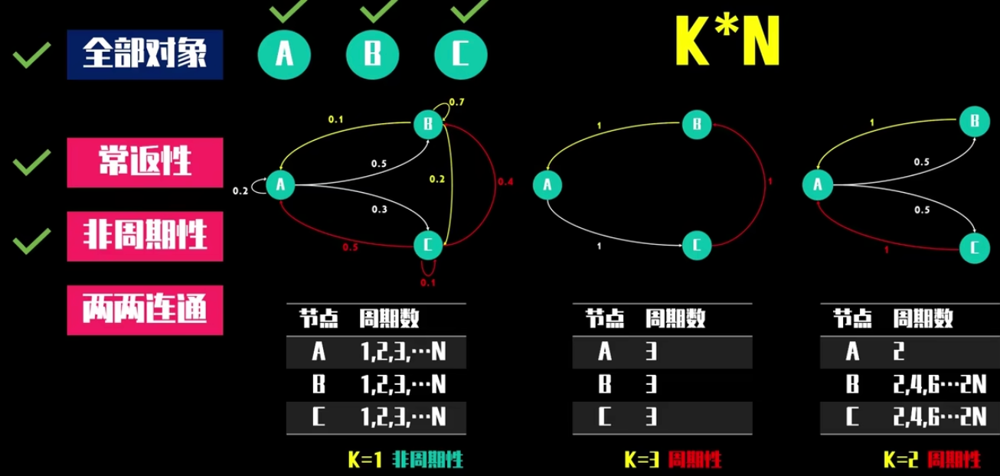

# 马尔科夫链

## 基础概念

### 三要素

马尔科夫链的核心三要素：

- **状态空间**：指马尔科夫链中所有可能的状态所组成的集合。用数学符号表示，若马尔科夫链的状态空间为$S$，则$S = \{s_1, s_2, \cdots, s_n\}$，其中$s_i$（$i = 1,2,\cdots,n$）表示第$i$个状态。例如，在一个描述天气的马尔科夫链中，状态空间可能是$S=\{晴天, 多云, 雨天\}$。
- **初始概率分布**：是指在马尔科夫链开始时，系统处于各个状态的概率分布。通常用一个行向量$\pi = (\pi_1, \pi_2, \cdots, \pi_n)$来表示，其中$\pi_i$表示系统初始时刻处于状态$s_i$的概率，且满足$\sum_{i = 1}^{n}\pi_i=1$。例如，在上述天气的马尔科夫链中，初始概率分布可能是$\pi=(0.6, 0.3, 0.1)$，表示初始时天气为晴天的概率是0.6，多云的概率是0.3，雨天的概率是0.1。
- **转移概率矩阵**：它描述了系统从一个状态转移到另一个状态的概率。对于一个具有$n$个状态的马尔科夫链，转移概率矩阵$P$是一个$n\times n$的矩阵，其中$P_{ij}$表示从状态$s_i$转移到状态$s_j$的概率，且满足$\sum_{j = 1}^{n}P_{ij}=1$，$i = 1,2,\cdots,n$。例如，对于天气马尔科夫链，转移概率矩阵可能是$P=\begin{bmatrix}0.7&0.2&0.1\\0.3&0.5&0.2\\0.2&0.4&0.4\end{bmatrix}$，表示晴天到晴天的转移概率是0.7，晴天到多云的转移概率是0.2等。

这三个要素完全确定了一个马尔科夫链的统计特性，通过它们可以对马尔科夫链的行为和演化进行分析和预测。

> 注意到马尔科夫链满足 **无记忆性**：在已知“现在”的条件下，“未来”与“过去”无关。用概率公式表示如下：
>
> 设$\{X_n, n = 0, 1, 2, \cdots\}$为一个马尔可夫链，状态空间为$S$。对于任意的$n \geq 0$，以及任意的$i_0, i_1, \cdots, i_{n - 1}, i, j \in S$，马尔可夫链的无记忆性可以表示为：
>
> $P(X_{n + 1}=j|X_{n}=i, X_{n - 1}=i_{n - 1},\cdots,X_{1}=i_{1},X_{0}=i_{0}) = P(X_{n + 1}=j|X_{n}=i)$
>
> 也就是说，在给定当前状态$X_n = i$的情况下，下一个时刻$n + 1$处于状态$j$的概率只与当前状态$i$有关，而与之前的状态$X_{n - 1}, X_{n - 2}, \cdots, X_0$无关。
>
> 还可以用条件概率的形式进一步表示为：
>
> $P(X_{n + k}=j|X_{n}=i, X_{n - 1}=i_{n - 1},\cdots,X_{1}=i_{1},X_{0}=i_{0}) = P(X_{n + k}=j|X_{n}=i)$，其中$k \geq 1$。
>
> 这表明在已知当前状态$X_n = i$时，不仅下一个时刻的状态与过去无关，而且未来任意时刻$n + k$的状态也只取决于当前状态$i$，与过去的状态历史无关。

### 稳态分布

#### 定义

设$\{X_n,n = 0,1,2,\cdots\}$是一个马尔科夫链，状态空间为$S$。如果存在一个概率分布$\pi=(\pi_j,j\in S)$，满足以下两个条件：

- **平稳性**：对于任意的$i,j\in S$以及$n\geq1$，有$\pi_j=\sum_{i\in S}\pi_ip_{ij}(n)$，其中$p_{ij}(n)$是马尔科夫链从状态$i$经过$n$步转移到状态$j$的转移概率。这意味着在经过足够长的时间后，系统处于状态$j$的概率不随时间变化，即系统达到了一种稳定的状态。
- **归一性**：$\sum_{j\in S}\pi_j = 1$，即所有状态的概率之和为1，保证$\pi$是一个合法的概率分布。

则称$\pi$为马尔科夫链的稳态分布。

#### 存在条件

- **不可约**：马尔科夫链的任意两个状态之间都可以相互到达，即对于任意的$i,j\in S$，存在正整数$n$使得$p_{ij}(n)>0$。
- **非周期**：对于状态空间中的每个状态，其返回时间的最大公约数为1。直观地说，就是从一个状态出发，再次回到该状态的时间不会呈现出固定的周期规律。
- **正常返**：马尔科夫链从任何一个状态出发，经过有限步后必然会以概率1返回该状态，且平均返回时间是有限的。

当一个马尔科夫链满足不可约、非周期且正常返这三个条件时，它一定存在**唯一的稳态分布**。

**假设我们在玩一个"城市通勤游戏"：**

1. **不可约性（所有地铁站连通）**

   - 无论你现在在哪个地铁站（状态），总能通过换乘到达其他任何一个地铁站（状态）。
   - 例如：从"朝阳门"站出发，虽然可能需要多次换乘，但理论上可以到达"中关村"站。
   - **关键**：整个系统没有被分割成互不连通的"地铁孤岛"。
2. **非周期性（地铁运行无固定周期）**

   

   - 地铁到达某一站的时间间隔没有固定规律。比如：
     - 有时连续3班都是快车（短间隔）
     - 有时连续2班是慢车（长间隔）
   - **关键**：状态返回自身的步数没有固定周期，避免了"必须每隔3步才能回来"的限制。
3. **正常返（地铁总会回来）**

   - 无论你离开某个地铁站多久，平均而言总能在有限时间内回来。
   - 例如：虽然可能连续出差3天没坐地铁，但平均每周会乘坐5次地铁回家。
   - **对比**：如果是"零常返"，就像虽然几乎肯定会中彩票，但平均需要等待1000年。

**三者结合的意义：**当一个马尔科夫链同时满足这三个条件时，它就像一个设计良好的地铁系统：

- 所有站点互联互通（不可约）
- 列车运行灵活无死循环（非周期）
- 每条线路都能稳定回归（正常返）
  这种情况下，系统会收敛到一个稳定的乘客分布（平稳分布），比如早晚高峰各站点的固定客流量比例。

**数学总结：**

- **不可约**：状态空间是单一连通类
- **非周期**：状态的返回步数没有公约数>1
- **正常返 recurrent**：状态的平均返回时间有限
  这三者共同保证了马尔科夫链具有遍历性，即长期运行后状态分布趋于稳定，且每个状态的访问频率等于其平稳概率。

#### 性质

- **唯一性**：在满足存在条件的情况下，马尔科夫链的稳态分布是唯一的。这意味着无论从何种初始状态开始，经过足够长的时间后，系统都会收敛到这个唯一的稳态分布。
- **与初始分布无关**：一旦马尔科夫链达到稳态，它的分布就不再依赖于初始状态的分布。也就是说，**无论最初系统处于何种状态，最终都会趋向于稳态分布**。

## 主要应用

- **预测长期行为**：在许多实际问题中，如天气预报、市场趋势分析、通信网络中的流量预测等，我们往往关心系统在长期运行后的行为。马尔科夫链的稳态分布可以帮助我们预测系统在长时间后处于各个状态的概率，从而为决策提供依据。
  - 自然语言处理：利用字符、词语之间的转移矩阵推断用户接下来会说什么；随机生成诗词
  - 金融行业：用于分析牛市、熊市状态转换、股票价格预测、信用评级
- **评估系统性能**：在排队论、可靠性分析等领域，通过分析马尔科夫链的稳态分布，可以评估系统的性能指标，如平均排队长度、设备的平均利用率等，进而对系统进行优化和改进。
- **模拟和仿真**：在计算机模拟和仿真中，马尔科夫链的稳态分布可以作为模拟的目标分布，用于生成符合特定概率分布的随机样本，从而对复杂系统进行建模和分析。

## 数学性质

### 马尔科夫性质

马尔科夫链的核心是马尔科夫性质，即系统在时刻$n$的状态$X_n$只依赖于其在时刻$n - 1$的状态$X_{n-1}$，而与更早的状态无关。用数学语言表示为：$P(X_{n}=x_{n}|X_{n - 1}=x_{n - 1},X_{n - 2}=x_{n - 2},\cdots,X_{0}=x_{0})=P(X_{n}=x_{n}|X_{n - 1}=x_{n - 1})$。

### 转移概率矩阵

- 对于一个具有离散状态空间$S=\{s_1,s_2,\cdots,s_N\}$的马尔科夫链，其转移概率矩阵$P=(p_{ij})$定义为$p_{ij}=P(X_{n + 1}=s_j|X_{n}=s_i)$，表示从状态$s_i$转移到状态$s_j$的概率。且满足$\sum_{j = 1}^{N}p_{ij}=1$，$i = 1,2,\cdots,N$。
- 如果马尔科夫链是时间齐次的，那么转移概率$p_{ij}$不依赖于时间$n$。

### 稳态的定义与存在条件

- **定义**：马尔科夫链的稳态是指当时间$n$趋于无穷时，系统处于各个状态的概率分布达到一个稳定的状态，不再随时间变化。设$\pi=(\pi_1,\pi_2,\cdots,\pi_N)$是稳态概率分布向量，其中$\pi_i$表示系统处于状态$s_i$的稳态概率。
- **存在条件**：对于一个有限状态空间的马尔科夫链，如果它是不可约（从任意一个状态都可以经过有限步转移到其他任何状态）且非周期（不存在一个正整数$d>1$，使得从任何状态出发，经过$d$的整数倍步才能回到该状态）的，那么它一定存在唯一的稳态概率分布。

### 稳态求解原理

- 从概率角度来看，根据马尔科夫性质和转移概率矩阵的定义，在稳态下有$\pi_j=\sum_{i = 1}^{N}\pi_ip_{ij}$，$j = 1,2,\cdots,N$，即稳态概率分布$\pi$满足$\pi=\pi P$，这是一个线性方程组。
- 从线性代数角度理解，转移概率矩阵$P$是一个随机矩阵，其特征值$1$对应的 **左特征向量** 就是稳态概率分布向量$\pi$。可以通过求解$(P - I)\pi=0$（其中$I$是单位矩阵），并结合$\sum_{i=1}^{N}\pi_i = 1$这个约束条件来确定$\pi$。

### 遍历定理

对于满足一定条件的马尔科夫链，遍历定理给出了更深入的结论。如果马尔科夫链是不可约、非周期且正常返的，那么对于任意的初始状态$i$，有$\lim_{n\rightarrow\infty}p_{ij}(n)=\pi_j$，其中$p_{ij}(n)$是$n$步转移概率，表示从状态$i$经过$n$步转移到状态$j$的概率。这意味着无论系统从哪个状态开始，随着时间的推移，系统处于各个状态的概率都会趋近于稳态概率分布。

> 首先，不可约。根据之前的回答，马尔科夫链的状态空间是明确的。不可约意味着从任何一个状态出发，都可以在有限步内到达其他任何状态，不管概率有多小。也就是说，状态之间没有被分割成独立的子系统。例如，一个天气模型如果是不可约的，那么无论今天是晴天还是雨天，未来总有一天可能会出现多云的情况，反之亦然。
>
> 接下来是非周期性。周期指的是状态返回自身所需的步数的最大公约数。如果这个最大公约数是 1，说明状态是非周期的。比如，如果一个状态只能在偶数步返回，那么它的周期是 2，是周期性的。非周期意味着状态可以在任何步数后返回，没有固定的周期限制。例如，交通灯的状态转换如果是非周期的，那么绿灯之后可以是黄灯或红灯，没有固定的间隔步数。
>
> 然后是正常返。正常返指的是状态的平均返回时间是有限的。也就是说，虽然状态可能会离开，但平均而言，它会在有限的时间内回来。例如，一个经常访问的网页，用户平均每小时访问一次，那么这个状态是正常返的。如果平均返回时间是无限的，那就是零常返，意味着虽然几乎肯定会返回，但平均需要无限长的时间，这在实际中可能不太有意义。
